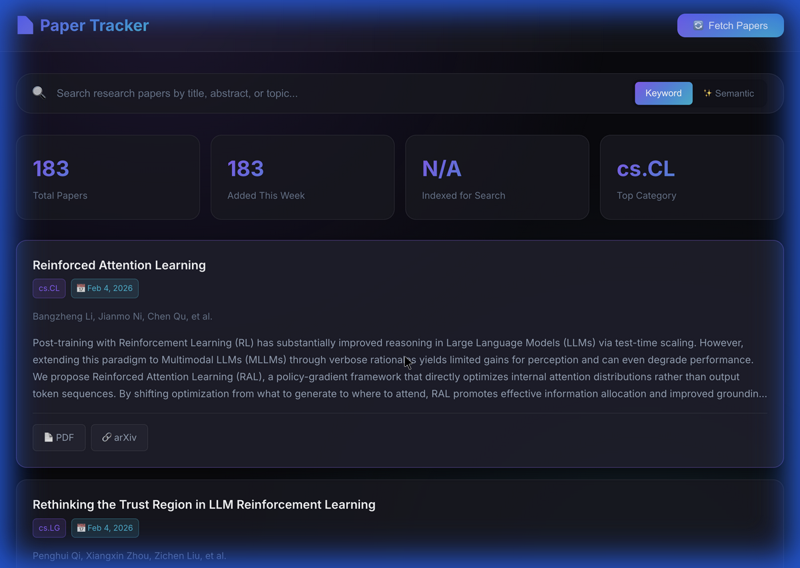

# Paper Tracker

A modern web application for tracking and searching LLM inference research papers from arXiv with semantic search capabilities.



## Features

- 📚 **Fetch Papers** - Automatically fetch LLM inference papers from arXiv
- 🔍 **Smart Search** - Keyword and semantic search using ChromaDB embeddings
- 📊 **Statistics** - Dashboard with paper counts and category breakdowns
- 🎨 **Modern UI** - Dark-themed React frontend with glassmorphism effects
- 📄 **Full Abstracts** - Click any paper to read the complete abstract
- 🔗 **Direct Links** - Quick access to PDF and arXiv pages

## Tech Stack

- **Backend**: Python, FastAPI, SQLite, ChromaDB
- **Frontend**: React, Vite
- **Data Source**: arXiv API, Semantic Scholar API

## Quick Start

### Prerequisites

- Python 3.10+
- Node.js 18+

### Installation

```bash
# Clone the repository
git clone https://github.com/chinmay29/paper-tracker.git
cd paper-tracker

# Install Python dependencies
pip install -e .

# Install frontend dependencies
cd web
npm install
cd ..
```

### Running the Application

**Start the backend:**
```bash
uvicorn paper_tracker.api:app --reload --port 8000
```

**Start the frontend (in a new terminal):**
```bash
cd web
npm run dev -- --port 5180
```

Open http://localhost:5180 in your browser.

### Fetch Papers

Click "Fetch Papers" in the UI, or use the CLI:
```bash
paper-tracker fetch --days 7
```

## API Endpoints

| Endpoint | Method | Description |
|----------|--------|-------------|
| `/api/papers` | GET | List papers with pagination |
| `/api/papers/{id}` | GET | Get paper by arXiv ID |
| `/api/search` | GET | Search papers (keyword/semantic) |
| `/api/stats` | GET | Database statistics |
| `/api/fetch` | POST | Fetch new papers from arXiv |

## CLI Commands

```bash
# Fetch papers from arXiv
paper-tracker fetch --days 7 --enrich

# List stored papers
paper-tracker list --limit 20

# Search papers
paper-tracker search "attention mechanism"

# Show paper details
paper-tracker show 2401.12345

# View statistics
paper-tracker stats
```

## Optional: Semantic Search

For semantic search capabilities, install ChromaDB:
```bash
pip install chromadb
```

Then restart the backend. The app will automatically index papers for vector search.

## Project Structure

```
paper-tracker/
├── src/paper_tracker/
│   ├── api.py          # FastAPI server
│   ├── cli.py          # CLI commands
│   ├── database.py     # SQLite operations
│   ├── embeddings.py   # ChromaDB integration
│   ├── models.py       # Data models
│   ├── arxiv_client.py # arXiv API client
│   └── semantic_scholar_client.py
├── web/
│   ├── src/
│   │   ├── App.jsx
│   │   ├── components/
│   │   └── api/
│   └── package.json
├── pyproject.toml
└── README.md
```

## License

MIT
